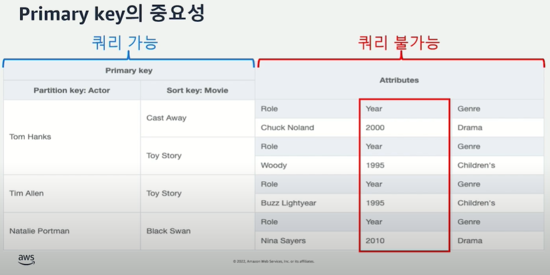

DynamoDB 연습
==========================================================================
#### 목차
1. DynamoDB 기초
2. DynamoDB 테이블 생성(웹 콘솔)

3. 데이터 생성,조회하기<br>
   3.1 웹콘솔로 진행하기<br>
   3.2 파이썬코드로 진행하기<br>


1.DynamoDB 기초
------------------------------------------------------------------------
DynamoDB에서는 테이블을 생성할 때 모든 attribute에 대한 스키마를 미리 정의해 둘 필요가 없다. 오직 Primary Key(PK)에 대한 스키마만 테이블을 생성할 때 정의하면 된다.

PK에는 단일 PK(simple key)와 복합 PK(composite key) 두가지 종류가 있다.
단이 PK는 하나의 attribute만을 primary key로 사용하고, 복합 PK는 두개의 attribute를 결합해서 사용한다.<br>
복합 PK에서 첫번째 attribute는 partition key, 두번째 attribute는 sort key라고 부른다.
<br>(attrbute는 RDB의 column과 유사하다)

Primary Key(PK)
* 단일 PK (Simple Key)
  * 단일 attribute
* 복합 PK (Composite Key)
  * attribute 1 : Partition Key
  * attribute 2 : Sort Key

DynamoDB는 검색을 위해서 PK로 인덱스를 생성한다. 테이블을 생성할 때 반드시 지정해야 하는 기본 키를 이용하여 생성되는 인덱스가 table index 이다.

단일 PK(simple key)는 Hash Type Key로 사용되며, 키의 기본 값은 스칼라 데이터 형식만 가능하다.

복합 PK(composite key)는 2개의 attribute 조합을 기본키로 사용하며, 첫번째 attribute는 Hash Type Key로 사용하고 두번째 attribute는 Range Type Key로 사용한다.

* 단일 PK Key 형식 : (KEY TYPE : HASH)
* 복합 PK Key 형식 : (partition key(KEY TYPE : HASH), sort key(KEY TYPE : RANGE))
  
PK(partition key)는 등호연산자 ==, SK(sort key)는 begins with(시작되는 값으로 찾는), 범위연산자(betwwen), 등호연산자를 사용할 수 있다.



DynamoDB에 대한 접근은 웹 콘솔, AWS CLI, 프로그래밍 언어별로 접근 등 여러 방식을 취할 수 있다.

2.DynamoDB 테이블 생성(웹 콘솔)
------------------------------------------------------------------------
DynamoDB 테이블 하나 생성 (웹콘솔에서 진행하기)

1. DynamoDB 콘솔로 이동
2. 대시보드에서 테이블 생성 선택
3. 테이블 이름, 파티션 키(PK), 정렬키(SK) 입력<br>
        ex. 테이블이름:Music_test, PK:Artist, SK:SongTitle
4. Default settings 선택, create 선택
5. (권장) 테이블 이름 클릭 - 백업 클릭 - 특정 시점 복구섹션 - 편집 클릭 - 시점복구켜기 - 변경사항 저장

3.데이터 생성,조회하기
------------------------------------------------------------------------
DynamoDB에 데이터를 생성하고, 조회해보기
데이터 생성은 웹 콘솔로도 해보고, 파이썬 코드에서도 해보기 (boto3, pynamodb 등의 라이브러리 찾아보고 테스트해보기)

### 3.1 웹콘솔로 진행하기
1. DynamoDB 콘솔로 이동
2. Tables(테이블) 선택
3. 테이블 목록에서 테이블 선택(ex. Music_test)
4. Explore table items(표 항목 탐색) 선택 - 반환된 항목 - 항목 생성 선택
5. PK, SK 입력<br>
    (ex.Music_test -> PK(Artist): ThornApple,  SK(SongTitle): Galaxy)
6. Add new attribute(새 속성 추가) 선택 후 자료형 선택<br>
    (ex. 문자열- AlbumTitle, 숫자- Awards 추가)
7. Create Item(항목 생성) 선택

### 3.2 파이썬 코드로 진행하기
테이블 모델을 pynamodb.models의 Model 클래스로 정의하고 .save()를 통해 저장, .get()을 통해 조회할 수 있다.
```python
    # 아이템 생성 및 저장
    item = MyModel('artist_1', 'song_1')
    item.save()

    # 아이템 조회
    item = MyModel.get('artist_1','song_1')
    # 조회한 아이템 파싱,출력
    print("Hash Key:",item.hash_key)
    print("Range Key: ",item.range_key)
```