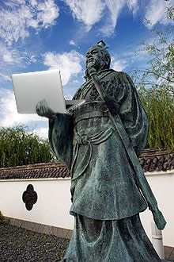

# Today I Learned

### 공부한것 정리, 기록

개발을 공부하면서 기록하지 않으니 머릿속에서 점점 희미해진다.

공부한 내용을 기록하니 다음에 찾아보기 쉬운 이점은 둘째치고 더 강하게 기억에 남아서 찾아보지 않게 되는 효과를 발견했다.
 
 

## 레포지토리

project- 로 시작하는 폴더엔 해당 프로젝트를 진행하며 수행한 작업과 트러블슈팅을 기록한다.

나머지는 기술조사, 사용법에 관련된 내용을 기록한다.(추후 디렉토리화 필요)

 
 

## 손자병법 공부(개발)법

 
손자는 손자병법 제 3장 '모공(Planninig)'편에서 다음과 같이 말했다.

 

    지피지기 백전불태

적을 알고 나를 알면 백번을 싸워도 위태롭지 않다.

개발을 공부하면서 중요한 것은 기술조사, 사용법이 아니라고 생각한다.(너무 기본)

더 중요한 것은 

    어떤 문제를 어떻게 해결하였느냐

 
이것은 요약된 말이지만 풀어서 생각해보면

 

    1. 어떤 문제인지 파악
        
        요구사항을 철저히 분석, 커뮤니케이션을 통해 문제를 정확히 인식한다.

    2. 어떻게 해결할지 고민

        문제를 정확히 인식했다면 해결 방법은 금방 떠오르는 경우가 많다. 
        모르겠다면 검색과 질문을 한다.

    3. try out
   
    4. 해결

 

1,2 에 집중(특히 1)해서 문제 해결을 하고 그것을 여기에 기록하려고 한다,,

 
 
 

(+ 추가) 
손자는 제 2장 '작전(Initiation)'편에서 전쟁의 무시무시함을 말하며 마음가짐을 단단히 먹고 최대한 빨리 전쟁을 끝낼것을 강조한다.

나는 이 가르침을 새기고 개발자로서 지켜야 할 덕목인 '시간준수'를 마음가짐을 단단히 먹고 지키겠다.

