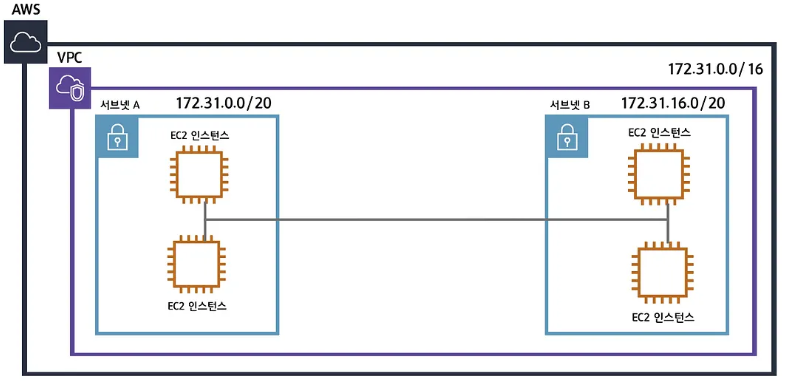

AWS 기초지식
=================================================================
### 목차
1. AWS 
   1.1 클라우드 컴퓨팅 
   1.2 AWS CLI

2. DynamoDB 
  2.1 NoSQL이란? 
  2.2 DynamoDB란?

1. EC2
2. VPC
3. Lambda

1.AWS
----------------------------------------------------------------
AWS(Amazon Web Services)는 아마존닷컴에서 개발한 클라우드 컴퓨팅 플랫폼이다. 
AWS는 클라우드 네트워킹 서비스를 기반으로 가상 컴퓨터와 스토리지, 네트워크 인프라 등 다양한 서비스를 제공한다.
### 1.1 클라우드 컴퓨팅이란?
기존의 물리적인 형태의 실물 컴퓨팅 리소스를 네트워크 기반 서비스 형태로 제공하는 것. 
네트워크 기반으로 제공되기 때문에 사용자는 네트워크 상에서 클라우드 서비스의 자원을 이용할 수 있다.

클라우드 컴퓨팅 서비스는 크게 세가지로 나눌 수 있다.
* IaaS ( Infrastructure as a Service )
* PaaS ( Platform as a Service )
* SaaS ( Software as a Service )

IaaS는 AWS, 네이버플랫폼과 같은 인프라스트럭쳐를 클라우드로 제공하는 서비스이다. 가상서버 또는 스토리지, 가상 네트워크 등의 리소스를 서비스한다. 
사용자는 물리적인 하드웨어를 직접 관리하지 않고 서비스를 이용해서 컴퓨터 리소스를 활용한다.

Paas는 DB 또는 Application 서버 등의 미들웨어를 제공한다.
하드웨어/OS/미들웨어의 관리는 서비스 제공자가 하고 사용자는 제공된 미들웨어만 이용.
사용자는 기본 인프라(하드웨어, OS)를 관리할 필요 없이 애플리케이션을 사용한다.

SaaS는 소프트웨어 또는 애플리케이션의 기능만 제공한다. 네이버 클라우드, 웹메일, ERP등과 같은 형태의 애플리케이션 서비스를 사용자에게 제공한다.  

위의 세가지 클라우드 컴퓨팅 서비스 중 IaaS에 해당하는 AWS 클라우드 서비스를 활용하면

1. 데이터센터 운영 및 유지관리에 비용투자가 필요없다
2. 언어 및 운영 체제에 구애받지 않는다.
3. 물리적 서버 구축에 시간이 필요없다.
   
등의 특징으로 인해 시간과 자본 운용의 간편함, 변환 및 확장의 용이함 등의 장점을 얻을 수 있다.  

### 1.2 AWS CLI 란?

AWS CLI는 AWS 클라우드 서비스와 상호작용하기 위한 명령줄 도구이다. 
AWS CLI를 사용해 AWS 계정과 서비스를 관리하고 다양한 AWS 리소스를 생성,수정,관리할 수 있다. 

제공하는 다양한 명령어는 AWS의 다양한 서비스와 리소스에 대한 작업을 수행하는데 사용된다. 
(ex EC2 인스턴스 생성, S3 버킷 관리, Lambda함수 배포, VPC 설정 등.)

명령줄에서 AWS 서비스와 상호작용하기 때문에 자동화 및 스크립팅 작업을 수행하기에 유용하다.   

2.DynamoDB
-----------------------------------------------------------------

### 2.1 NoSQL이란?
NoSQL이란 용어는 비관계형 데이터베이스 유형을 가리키며 관계형 테이블과는 다른 형식으로 데이터를 저장한다. 

#### RDB(관계형 데이터베이스)와 차이
SQL DB는 관계형인 반면 NoSQL DB는 비 관계형이다.
관계형 DBMS는 구조화된 쿼리언어(SQL)기반이다. 
이를 통해 사용자는 정밀하게 구조화된 테이블에서 데이터에 엑세스하고 데이터를 조작한다.
(MS SQL, IBM DB2, Oracle, MySQL)
하지만 NoSQL DB에서는 데이터 엑세스 구문이 DB마다 다를 수 있다.

관계형 DB는 정밀하게 구조화된 테이블에 데이터를 저장하고, 각 테이블은 사전에 정의된 키를 사용해 여러 테이블이 연결되는 방식이다.  
이 데이터베이스 유형은 스키마를 사전에 정의해야 한다. 다시말해 모든 열과 관련된 데이터 유형이 사전에 파악되어야만 애플리케이션이 데이터를 데이터베이스에 작성할 수 있다.

NoSQL DB에서는 데이터는 사전에 스키마를 정의하지 않아도 저장될 수 있다.
작업을 진행하는 동시에 데이터를 정의하는 방식으로 빠르게 데이터를 작성하고, 이를 반복할 수 있는 능력을 얻게 된다. 
이런 이점으로 인해 NoSQL DB는 그래프 기반, 열 지향, 문서 지향 또는 키-값 저장소 등 특정 비즈니스 요구사항 수행에 적합하다.

#### NoSQL을 쓰는 이유
최근까지도 관계형 데이터베이스가 가장 널리 사용되는 모델이었고 지금도 다양한 기업들에서 보편적으로 사용되고 있다. 그러나 오늘날 사용되는 데이터의 다양성, 속도, 양을 감당하기 위해서는 관계형 데이터베이스를 보완할 전혀 다른 데이터베이스가 필요하다. 

이와 같은 상황에서 신속한 수평적 확장능력 덕분에 높은 트래픽을 처리할 수 있는 NoSQL이 선택받기 시작하고 있다.

높은 확장성과 가용성이 주요 장점인 NoSQL 데이터베이스는 실시간 웹 애플리케이션 및 빅데이터에 널리 사용된다.

변화하는 요구사항에 빠르게 적응함으로써 민첩한 개발 패러다임에 자연스럽게 활용되는 이점을 활용하고 싶은 개발자들 역시 NoSQL을 선호한다. 

NoSQL 데이터베이스를 사용하면 데이터는 보다 직관적이고 이해하기 쉬운 방식 또는 애플리케이션이 사용하는 것에 가까운 방식으로 저장된다. 
NoSQL 스타일의 API를 사용하면 저장 또는 검색 시 데이터 변환의 필요성이 줄어든다.  
또한 NoSQL DB는 다운타임이 없는 클라우드의 이점을 완전히 누릴 수 있다.

 

### 2.2 DynamoDB

Amazon DynamoDB는 AWS에서 제공하는 서버리스 기반 Key-Value NoSQL 데이터베이스 서비스이다. 
DynamoDB는 NoSQL의 이점인 빠른 성능, 확장성, 내구성, 안정성 및 유연성을 제공한다. 
또한 높은 성능 대비 비용적인 측면에서 이점을 활용할 수 있다.

DynamoDB는 AWS에서 완전히 관리되므로 데이터베이스 서버, 클러스터 구성, 확장 및 유지 관리에 대한 걱정 없이 데이터에 집중할 수 있다.

DynamoDB는 스키마리스 NoSQL 데이터베이스로, 테이블은 JSON과 유사한 형식인 아이템으로 구성된다. 이는 데이터 구조를 자유롭게 정의하고 변경할 수 있음을 의미하며, 다양한 데이터 모델에 적합하다.

다음은 DynamoDB의 특징 요약이다.

  * NoSQL기반
    * JOIN 개념이 없다.
    * 따라서 정규화도 거의 불가능하다. 때문에 NoSQL DB들은 보통 반정규화를 한다.
  * HTTP 통신
    * HTTP를 사용하기 때문에 다른 DB와 달리 TCP connection기반이 아닌 Connectionless이다.
  * Key-Value
    * 키를 제외한 테이블의 속성을 미리 정의할 필요가 없다.
    * 따라서 스키마를 미리 만들 필요가 없고, 유연하게 데이터를 처리할 수 있다.
  * Serverless
    * 서버리스이기에 DynamoDB를 위한 별도의 서버가 존재하지 않는다.
    * 요청한 만큼만 비용을 지불한다.
    * AWS Lambda와 같은 다른 서버리스 기반 서비스와 좋은 시너지를 기대할 수 있다.

  

4.EC2
-----------------------------------------------------------------
EC2는 AWS가 제공하는 가상 서버 서비스로, 아마존으로부터 한 대의 컴퓨터를 임대받을 수 있는 서비스이다.

EC2는 다음과 같은 특징과 장점을 갖는다.

1. 다양한 운영체제를 지원한다. (Linux, Windows .. )
   
2. 다양한 인스턴스 유형을 지원한다. (컴퓨팅 중심, 메모리 중심, 그래픽 중심, 스토리지 중심 .. )
   
3. 크기 조정이 유연하다. -> 필요에 따라 가상 서버의 용량을 확장/축소 가능하다.
   
4. EC2 이미지 및 스냅샷을 이용해 데이터 백업 및 복구를 지원한다.
   
5. AWS VPC를 이용해 네트워크 환경을 설정하고 가상 서버간 통신을 보호할 수 있다.
   
6. AWS IAM을 이용해 EC2 인스턴스 및 자원에 대한 엑세스와 권한을 관리/보호할 수 있다.

위와 같은 특징과 장점을 정리하면, 탄력적인 용량 조절을 통해 비용 관리에 유용하고(저렴하기도 하다), 인스턴스를 완전히 제어할 수 있으며, 네트워크 구성과 스토리지 관리, 보안 구성에 효과적인 서비스라고 할 수 있다.

5.VPC
-----------------------------------------------------------------

VPC(Virtual Private Cloud)는 AWS에서 제공하는 네트워크 가상화 서비스로, 사용자가 AWS 클라우드 내에서 가상 네트워크를 설정하고 구성할 수 있게 해준다.
VPC를 사용하면 AWS 리소스 간의 네트워크 트래픽을 안전하게 분리하고 제어할 수 있으며, 사용자의 데이터와 애플리케이션을 보호하고 네트워크 구성을 사용자 지정할 수 있다.

VPC가 없으면 위와 같이 EC2 인스턴스들과 클라우드 리소스들이 네트워크상으로 거미줄처럼 연결되고 인터넷과 이어진다. 
이런 구조는 시스템의 복잡도를 심하게 끌어올리고 인스턴스나 리소스 추가 및 확장에 불편함을 야기시킨다.

VPC를 적용하면 위와 같이 VPC별로 네트워크를 구성할 수 있고 각각의 VPC에 따라 다르게 네트워크 설정을 부여할 수 있다. 또한 각각의 VPC는 완전히 독립된 네트워크처럼 작동한다.
 
 

VPC를 생성한 후에 서브넷을 만들어 네트워크를 더 잘게 분리해 더 많은 네트워크 망을 만들 수 있다. 각각의 서브넷은 가용영역 안에 존재하며 서브넷 안에 EC2, RDS와 같은 리소스를 위치시킬 수 있다.

또한 VPC 내에 라우팅테이블을 작성해서 로컬 요청을 처리할 수 있고 그 외의 트래픽은 인터넷 게이트웨이를 이용해 처리된다.

인터넷과 연결되어있는 서브넷을 퍼블릭서브넷, 연결되지 않은 서브넷을 프라이빗 서브넷이라고 한다.

최종적으로 보안그룹을 설정하면 다음과 같은 구조로 VPC를 이용할 수 있다.

 
 

6.Lambda
-----------------------------------------------------------------
Lambda는 AWS가 제공하는 서버리스 컴퓨팅 플랫폼이다.
DynamoDB와 같이 서버리스이기 때문에 사용한 시간, 용량에 대해서만 AWS에 비용을 지불한다.

Lambda는 코드를 계속 실행시키기보다, 특정한 시기(이벤트 발생)에 실행시키는 경우에 사용하면 유용하다.
Lambda는 다음과 같은 경우에 사용이 용이하다.
  * 서버를 띄우지 않고 간단한 코드를 실행시키는 경우
  
  * 특정 기간 또는 특정 주기로 코드를 실행시켜야 하는 경우
  
  * 트리거가 실행될 때만 코드를 실행시키고 싶은 경우

Lambda는 다양한 프로그래밍 언어를 지원하기 때문에 개발자가 선호하는 언어로 함수를 작성할 수 있으며, 트래픽에 따라 자동으로 확장되므로 많은 요청에 대한 동시처리를 보장한다.

사용법은 함수생성 - 함수이름 설정, 사용언어 선택 - 코드 추가 - 실행 시 메모리, 시간 설정 - 테스트 이벤트 구성/ 실행으로 테스트
형식으로 매우 간단하게 설정할 수 있다.

코드는 인라인 코드로 직접 타이핑해도 되고, zip파일 업로드 방식으로도 업로드 할 수 있다.

사용시에 다음과 같은 사항을 주의해야 한다.
  * 코드 용량은 최대 250MB
  
  * 함수 실행시간은 최대 15분
  
  * 처음 함수 호출 시 cold start로 인한 초기 지연시간 발생
  
  * 생각보다 저렴하지 않은 비용