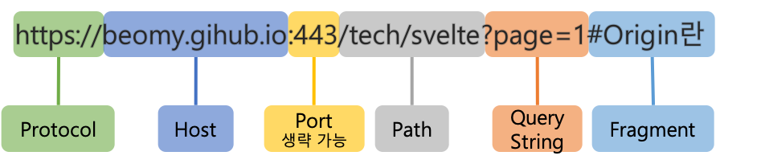

# CORS (Cross-Origin Resource Sharing)

CORS 에러는 개발하면서 많이 겪을 문제입니다. 보통 브라우저에서 교차출처자원공유(CORS)를 기본적으로 거부하고있기 떄문에 그렇구요. 보통은 API / 웹서버쪽에서 응답으로 allow-cross-origin 헤더같은걸 따로 내려보내주고, 허용된 method 같은것도 추가적으로 내려줘야 잘 동작하게 됩니다.

디테일한내용은 따로 찾아보고 나중에 정리해주세요! 지금은 우선 모든 요청(호스트)에 대해서 CORS를 브라우저에 허용하도록 작업했습니다. (ref : glow-kor/glow-backend#38)

------------------------------------------------------------------------------

목차

1. CORS란 무엇인가?
2. CORS의 동작 
    2.1 Simple Request인 경우 
    2.2 Preflight Request인 경우
3. FastAPI 에서의 CORS 설정

## 1. CORS란 무엇인가?

CORS(Cross-Origin Resource Sharing)는 직역하면 교차되는 출처 자원의 공유로, 한 출처에 있는 자원에서 다른 출처에 있는 자원에 접근하도록 하는 개념이다.

다른 출처에 있는 자원을 요청하는 경우에 교차 출처 요청이라고 부른다.

### 출처란?

URL상 Protocol + Host + Port 까지 같을 경우 동일 출처(Origin)이라고 한다.
이 중 하나라도 다를 경우 다른 출처로 간주된다.

웹 어플리케이션 개발 시 프론트엔드와 백엔드의 개발편이성을 위해 서버를 분리하는 경우가 많으므로, 대부분 다른 출처에서의 데이터 교환이 이루어져야 한다.  

### 동일 출처 정책 (Same-Origin Policy)

이미지, 스크립트, 프레임, 비디오, 오디오 등이 웹에 등장하면서, 페이지 로딩 이후에 브라우저에서 이러한 하위 자원들을 가져올 수 있게 되었다.그러므로 동일 출처, 다른 출처 모두 호출이 가능하게 되었다.

하지만 다른 출처에서 기인한 여러 작업들이 해당 오리진의 큰 오류나 공격을 일으킬 수 있기 때문에 다른 출처의 접근을 위해서 동일 출처 정책이 등장하게 되었고 현재 모든 브라우저는 동일 출처 정책을 따르고 있다.

동일 출처 정책에 따라 브라우저는 다른 출처에서의 요청들을 제한하지만, 서버가 HTTP-header를 이용해 동의하는 경우는 허용한다. 이를 CORS(Cross-Origin Resource Sharing), 즉 교차 출처 자원의 공유라고 부르며 브라우저에서의 cross-origin 요청을 안전하게 수행할 수 있도록 하는 매커니즘이다.

## 2. CORS의 동작

### 2.1 Simple request인 경우

요청이 Simple Request인 경우 다음과 같이 동작한다.

예비 요청을 보내지 않고 바로 본 요청을 보낸 후, 응답 헤더의 Access-Control-Allow-Origin 값을 확인 후 CORS정책 위반 여부를 검사하는 방식.

1. 서버로 요청 전송
2. 서버의 응답 검사(브라우저가)

    서버의 응답이 왔을 때 요청한 Origin과 응답 헤더 Access-Control-Request-Headers의 값을 비교하여 유효한 요청이라면 리소스 응답을 허용한다.

    만약 유효하지 않은 요청이라면 브라우저에서 제한하고 에러가 발생한다.

        Simple Request란?

        HTTP 메소드가 다음중 하나여야 함
        GET, HEAD, POST

        자동 설정 헤더를 제외하고, 설정할 수 있는 다음 헤더들만 변경할 때
        Accept, Accept-Language, Content-Language

        Content-Type이 다음과 같은 경우
        application/x-www-form-urlencoded, multipart/form-data, text/plain

        위와 같은 요청을 Simple Request라고 부르며 이 요청들은 추가적으로 확인하지 않고 바로 본 요청을 보낸다.

### 2.2 Preflight Request일 경우

일반적으로 웹 앱을 개발할 때 가장 많이 마주치는 시나리오로, 이 상황에서 브라우저는 요청을 한번에 보내지 않고 예비 요청과 본 요청으로 나누어서 서버로 전송한다.

본 요청을 보내기 전에 보내는 예비 요청을 Preflight라고 하며, Preflight에는 OPTIONS 라는 메소드가 사용된다.

1. 브라우저가 서버에 예비 요청 전송
2. 서버는 응답으로 현재 허용사항과 금지사항을 헤더에 담아 응답
3. 브라우저가 예비 요청과 응답에 담긴 정책을 비교, 안전성 판단 후 본 요청 전송
 
 

## 3. FastAPI에서의 CORS 설정

FastAPI에서는 CORSMiddleware라는 모듈로 CORS를 제어한다.

다음과 같은 설정으로 main에서 CORS를 설정할 수 있다.

    
    from fastapi import FastAPI
    from fastapi.middleware.cors import CORSMiddleware

    app = FastAPI()

    # origins에는 protocal, domain, port만 등록한다.
    origins = [
        "http://192.168.0.13:3000"
        # url을 등록해도 되고
        # private 영역에서 사용한다면 "*" 로 모든 접근 허용 가능
    ]

    app.add_middleware(
        CORSMiddleware,
        allow_origins=origins,
        allow_credentials=True, # cookie 포함 여부 설정, 기본은 False
        allow_methods=["*"],    # 허용할 method를 설정, 기본값은 'GET'이다.
        allow_headers=["*"],	# 허용할 http header 목록을 설정.
        # Content-Type, Accept, Accept-Language, Content-Language은 항상 허용
    )

