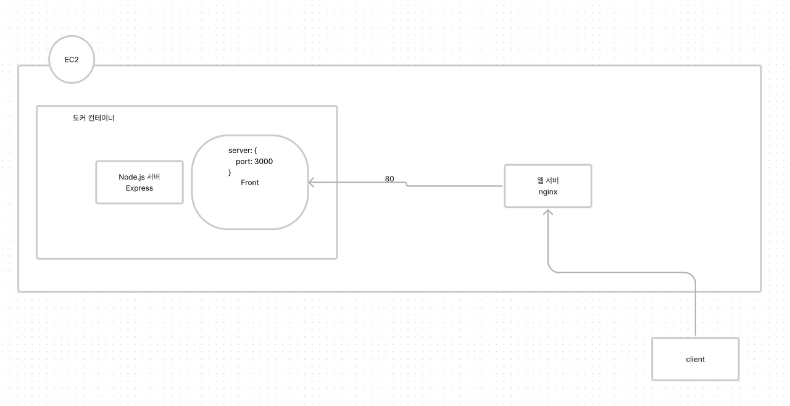

# 트래픽 살펴보기

지금 현재 Route53 -> AWS LoadBalancer (ALB) -> EC2 -> nginx -> 도커 앱
이렇게 트래픽이 들어가고있거든요. 
(https://app.glowcorp.io / https://api.glowcorp.io )
그래서 한번 아마존 콘솔에서 어떤게 어떻게 설정되어있는지 확인해보시고. 
대충 구조가 이렇게 되여 트래픽이 들어가는구나? 정도 알면 좋을 것 같고. 서버에도 /etc/nginx/conf.d 디렉터리에 설정파일들이 들어가있어요

아무튼 ! Route53 -> 아마존 로드밸런서 -> EC2 (nginx) 이런 구조의 트래픽이 넘어가는 플로우를 한번 확인해보시고. 
아마 레퍼런스가 블로그나 뭐 글들이 꽤 있을거거든요? 한번 살펴보세요!

## 트래픽 유입 절차

1) Route53
   
    Amazon Route 53 : DNS(Domain Name System) 웹 서비스. 
    도메인 등록, DNS 라우팅, 상태확인을 할 수 있다.

2) AWS LoadBalancer

3) EC2
    
    3.1 nginx
    
    3.2 도커 앱

## Route53 - ALB 연동하기

1. 시스템 구성
   1. VPC 생성 
        VPC: AWS 클라우드의 격리된 부분. EC2 인스턴스와 같은 AWS객체로 채워짐 
        이름, IPv4 CIDR 설정

   2. Public Subnet 생성 
        VPC ID를 입력해 해당 VPC에 1개 이상의 서브넷 생성 
        서브넷 이름, 가용영역(아마존 지역), IPv4 cidr 블록 설정

   3. Internet Gateway 설정 
        인터넷 게이트웨이를 생성해 인터넷 구간에서 접근할 수 있도록 설정 
        게이트웨이 이름 설정, VPC 선택. 
        생성 후 상태를 detached -> attached 로 변경해야 활성화 

   4. Routing Table 작성 
        라우팅 테이블을 이용해 각 영역(VPC,Subnet,Gateway)이 실제 서로 통신할 수 있도록 설정 
        VPC에 라우팅 테이블 생성 : VPC 연결, 테이블명 설정 
        라우팅 테이블 - 게이트웨이 연동 : 라우팅 편집(라우팅 추가) 
        서브넷 연결

   5. EC2 인스턴스 생성(연동) 
            각 서브넷에 인스턴스 별도로 생성 
            인스턴스에 httpd(Apache) 설치(** 작동 확인을 위한 테스트용 웹서버!!!)
   
   6. ALB 설정 
        별도의 서브넷에 생성한 다수의 EC2를 ALB로 묶어 로드밸런싱 하도록 설정. 
        EC2 화면 -> 로드밸런서 선택 -> 로드밸런서 생성 
        로드밸런서 체계: 인터넷 경계, 
        가용영역 설정, 
        보안그룹: 새 보안그룹, 80 포트 규칙 추가 
        라우팅 구성 대상그룹 유형 : '인스턴스' 타입 
        대상 등록 : 다수 EC2 추가 

        생성완료 -> DNS 이름 복사할것!
   
2. 도메인 등록(Route53)

    로드밸런서에서 생성된 주소를 Route 53을 통해 DNS 등록

3. DNS Record 등록, 연동

    Route 53 -> 호스팅 영역 -> 생성된 도메인 이름 선택 -> 세부정보보기 
    레코드 생성: 레코드 이름, 유형, 트래픽 라우팅 대상(생성한 ALB 선택)

  
위와 같은 과정을 통하면

레코드이름.도메인명 으로 해당 인스턴스에 로드밸런싱을 거쳐 접속할 수 있다.

## EC2 내부 트래픽

nginx를 사용한다면 위 그림과 같이 Client로부터 오는 요청은
EC2 내부에서 nginx를 거쳐 포트를 통해 앱으로 전달되게 된다.

    // nginx 설치하기(Amazon EC2 환경)
    sudo amazon-linux-extras install nginx1

    // nginx 시작
    sudo systemctl start nginx

    // nignx.conf 같은 설정 파일 변경시 재시작
    sudo systemctl restart nginx

    // nginx 상태 확인
    sudo systemctl status nginx

nginx 사용을 제어하기 위한 설정은 conf 파일에 설정함으로써 간편하게 설정을 관리할 수 있다.

